# qshort Project Documentation

This is the project documentation of the qshort project from Tom Hüttmann.


## Table of Contents
- [qshort Project Documentation](#qshort-project-documentation)
    - [Table of Contents](#table-of-contents)
    - [Service Description](#service-description)
    - [User Operation Manual](#user-operation-manual)
        - [Create Basic Shortened URL](#create-basic-shortened-url)
        - [Open Basic Shortened URL](#open-basic-shortened-url)
        - [Create Shortened URL with Multiple Entries](#create-shortened-url-with-multiple-entries)
        - [Open Shortened URL with Multiple Entries](#open-shortened-url-with-multiple-entries)
        - [Generate QR-Code for Shortened URL](#generate-qr-code-for-shortened-url)
        - [Specify Advanced Parameters for Shortened URL](#specify-advanced-parameters-for-shortened-url)
        - [Open Password Protected Shortened URL](#open-password-protected-shortened-url)
        - [Overview of Shortened URLs](#overview-of-shortened-urls)
        - [Information about Shortened URL](#information-about-shortened-url)
        - [Modify Shortened URL](#modify-shortened-url)
        - [Delete Shortened URL](#delete-shortened-url)
        - [Analyze Recent Shortened URLs](#analyze-recent-shortened-urls)
        - [Navigation](#navigation)
        - [Sorry Page](#sorry-page)
    - [Architecture](#architecture)
        - [Overview](#overview)
        - [Environments](#environments)
        - [Development](#development)
        - [Deployment](#deployment)
        - [Component Interactions](#component-interactions)
    - [Component Decisions Frontend](#component-decisions-frontend)
        - [HTML Template](#html-template)
        - [JavaScript](#javascript)
        - [Simple Notify](#simple-notify)
        - [Sweetalert2](#sweetalert2)
    - [Component Decisions Backend](#component-decisions-backend)
        - [MongoDB](#mongodb)
        - [python:3-slim](#python3-slim)
        - [flask](#flask)
        - [structlog](#structlog)
        - [pymongo](#pymongo)
        - [flask_restful](#flask_restful)
        - [nanoid](#nanoid)
        - [bcrypt](#bcrypt)
        - [qrcode](#qrcode)
        - [apispec](#apispec)
    - [Twelve-Factor App](#twelve-factor-app)
        - [1. Codebase](#1-codebase)
        - [2. Dependencies](#2-dependencies)
        - [3. Configuration](#3-configuration)
        - [4. Supported Services](#4-supported-services)
        - [5. Build, Release, Run](#5-build-release-run)
        - [6. Process](#6-process)
        - [7. Port Binding](#7-port-binding)
        - [8. Concurrency](#8-concurrency)
        - [9. Disposable Use](#9-disposable-use)
        - [10. Dev-Prod-Comparability](#10-dev-prod-comparability)
        - [11. Logs](#11-logs)
        - [12. Admin Processes](#12-admin-processes)
    - [Api Documentation](#api-documentation)


## Service Description
qshort is a URL shortening service, which means that the basic scenario of this single service application is creating short redirect URLs for given URLs.
Shortening huge given URLs and make it's content accessible via a created shortened URL is therefore the biggest benefit of this service.
What sets the service apart from others is the extensive configuration customization, for instance protecting the shortened URLs with a password or creating a QR-Code for the shortened URL on the fly.
All implemented features and how to use them are explained in [User Operation Manual](#user-operation-manual).
Currently, the productive environment of the service is accessible via the Ingress endpoint of the [th-luebeck.dev](https://qshort-6074.edu.k8s.th-luebeck.dev/) domain or the alternative way shorter domain [1wp.de](https://1wp.de/), which uses a reverse proxy to redirect to the first mentioned domain.

An alternative URL shortening service with comparable features would be [t1p.de](https://t1p.de/).


## User Operation Manual
This chapter will list all features of the app and describes its respective use, staring from basic to advanced usage.

### Create Basic Shortened URL
Creating a simple shortened URL is pretty intuitive.
It's sufficient to visit the root entry point `/` of the service, entering a valid URL into the first visible input text box and finally clicking on the `Short Link` button, as shown in the following image.
Valid URLs are for instance: `http://google.de`, `https://google.de/path` or even `google.de/path1/path2`

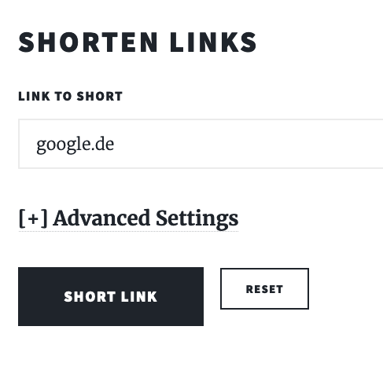

The output of this action could for instance look like the following image.
The created shortened URLs is visible at the top next to a button to directly copying this new URL into the clipboard.
Also, the specific properties of the shortened URL are visible below, for instance the given targeted URL and a for the shortened URL defined master key to make modifications possible, see [Modify Shortened URL](#modify-shortened-url).
In the end, there is also a button `Short another one` to directly switch back to the view to create a new shortened URL.

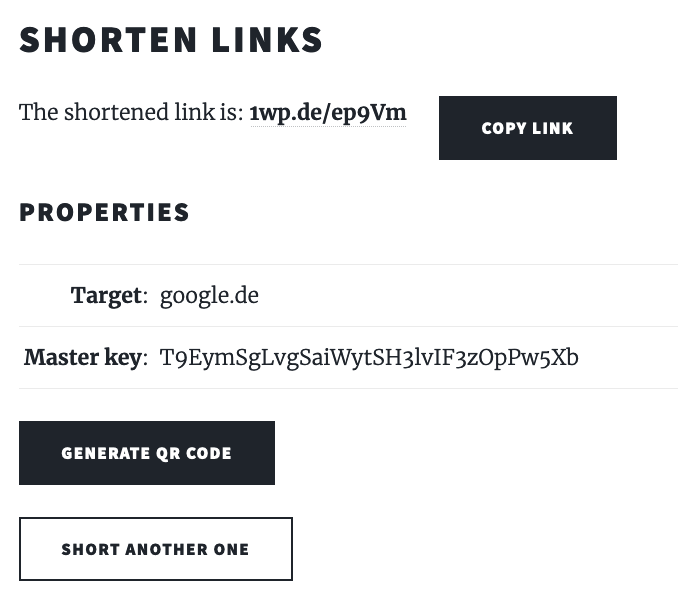

### Open Basic Shortened URL
To open for instance a basic shortened URL created like described in [Create Basic Shortened URL](#create-basic-shortened-url), it's enough to just open the created shortened URL in a browser.
The service looks automatically for the mapped URL and redirects the user to this.

### Create Shortened URL with Multiple Entries
A further core feature of this service is to create a shortened URL mapping on multiple entries of given URLs.
To use this feature, clicking on the title `Advanced Settings` and the checkbox to enable `multiple entries` is necessary.
This exchanges the input text field for single links into an input textarea, where each URL entry should be entered into a separated line, as explained in the example placeholder.
The following process would be identical to the basic creation of shortened URLs.
The idea behind this feature is to directly transfer a big set of links to desired people, for instance shopping interests, list of favorite browser bookmarks or used references in papers.

### Open Shortened URL with Multiple Entries
Opening a shortened URL created with multiple entries is similar to shortened URLs with only one single redirection target.
But instead of the redirect on the fly to the targeted URL, a new view with a table containing the multiple entries has been rendered and could look like the following image.
The table only shows a maximum of five entries at once, more entries can be shown via the pagination below.

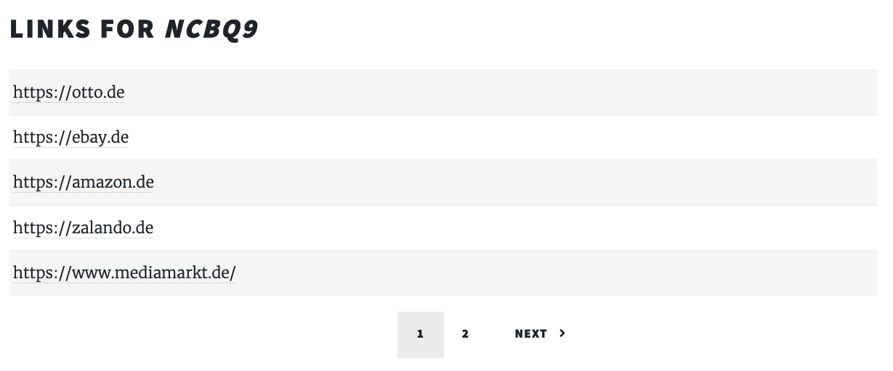

### Generate QR-Code for Shortened URL
For each created shortened URL, it's also possible to create a references QR-Code.
To use that feature, it's enough to click on the `Generate QR Code` button, visible after the process of creating a shortened URL.
Clicking this button triggers the necessary backend APIs and automatically renders the created QR-Code into the view, like the following image shows.
There is also an option to download this created QR-Code onto the host machine.
One more important thing to mentioned would be that this created QR-Code maps to the created shortened URL, which makes later modification of for instance the targeted URL possible.


### Specify Advanced Parameters for Shortened URL
The area behind the `Advanced Settings` is hidden by default to minimize confusion for new customers, was already slightly tackled due to the creation of multiple links and as already mentioned there is accessible via pressing the `Advanced Settings` headline.
The image at the end of these subsections gives a great overview of all possible properties which could be set there.
Mainly those advanced parameters are to enable some protection of the shortened URLs and will be described separately in the following.

The **password** field enables a password protection for the shortened URLs, which make access to the targeted URLs depending on the correct password.
This password can contain numerous characters and has for the sake of simplicity currently no length limit, which nevertheless could be adapted easily if needed in the future.
Opening such a with a password protected shortened URL is described in the following subsection [Open Password Protected Shortened URL](#open-password-protected-shortened-url).

A concrete **end duration** prevent resolves against the shortened URL after the set date.
Therefore, this set date can only be set to the future to even make sense.

The **desired URL path** parameter will check if the customer wish of the path of the shortened URL is still available and if so uses this for the new created shortened URL.
This path can only consist of small letters, capital letters and numbers.

The **path length** parameter is more like a funny feature and not that meaningful.
With this parameter it is possible to create pretty long "*shortened*" URLs with the maximum path length of 2048.
Furthermore, all path lengths between the default length of five and this maximum number are possible of course.

The **click limit** parameter, as the name already says, makes the shortened URL inaccessible after the reached limit of resolves.
This parameter has the minimum of one and maximum of two billion, which of course are easily to adapt in the future as well.

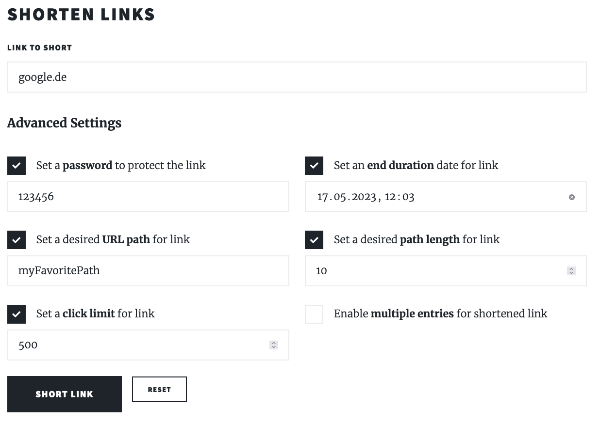

### Open Password Protected Shortened URL
The opening of a password protected shortened URL is similar to the unprotected once, with the only difference that the redirect to the single targeted URL or the targeted multiple URLs doesn't happen on the fly.
Instead, a new view with the need to enter the for the shortened URL used password is rendered as shown in the following image.
When entering a non-matching password an error message to the user has been shown, otherwise either the redirect in case of a single target or the view of the table happens.


### Overview of Shortened URLs
The overview of all from the user created shortened URLs is a new entry point of the service, accessible via `/myLinks`.
The view could look like the following image, containing the possibility to add links to this view and the general overview via the table of all created shortened URLs.
When adding a link, it is necessary to enter the path with the matching master key, which will only be visible in the frontend once when creating a shortened URL.
Therefore, when the plan is to make the same link accessible inside this view over more than one device, it makes sense to store this one time visible master key save on the host machine in a password safe for instance.

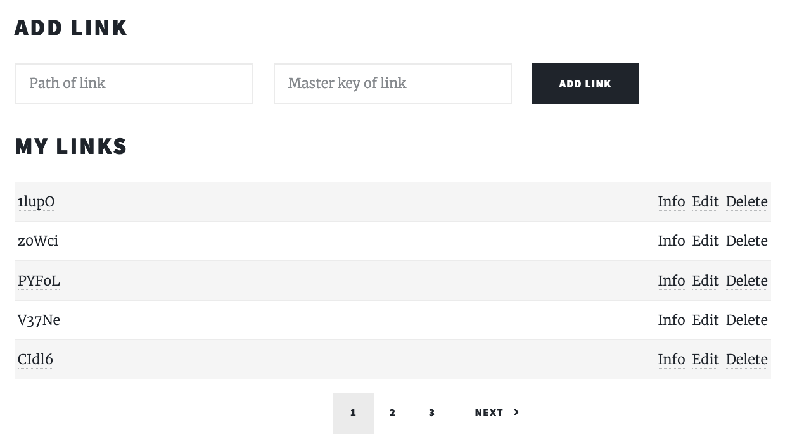

### Information about Shortened URL
To receive further information about an already created shortened URL, it's enough to click on `Info` next to the according table entry of the shortened URL in the overview explained in [Overview of Shortened URLs](#overview-of-shortened-urls).
The following image shows an example view of this information for the shortened URL.
In contains a table for the properties: target, clicks, click limit, has password, end duration, created date and edited date.

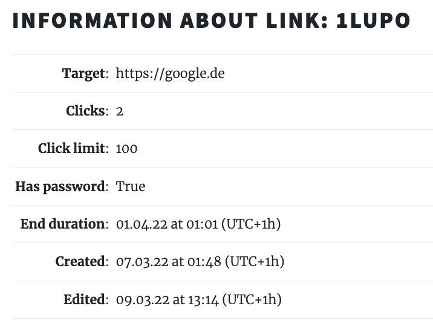

### Modify Shortened URL
The modification of a shortened URL is accessible via the `Edit` reference next to the according table entry of the shortened URL in the overview explained in [Overview of Shortened URLs](#overview-of-shortened-urls).
This will render a view which could be look like the following image and makes the modification of the parameters: path, password, target URL or even target URLs, end duration and the click limit possible.
Saving those new entries is done by clicking the `Save` button at the end.

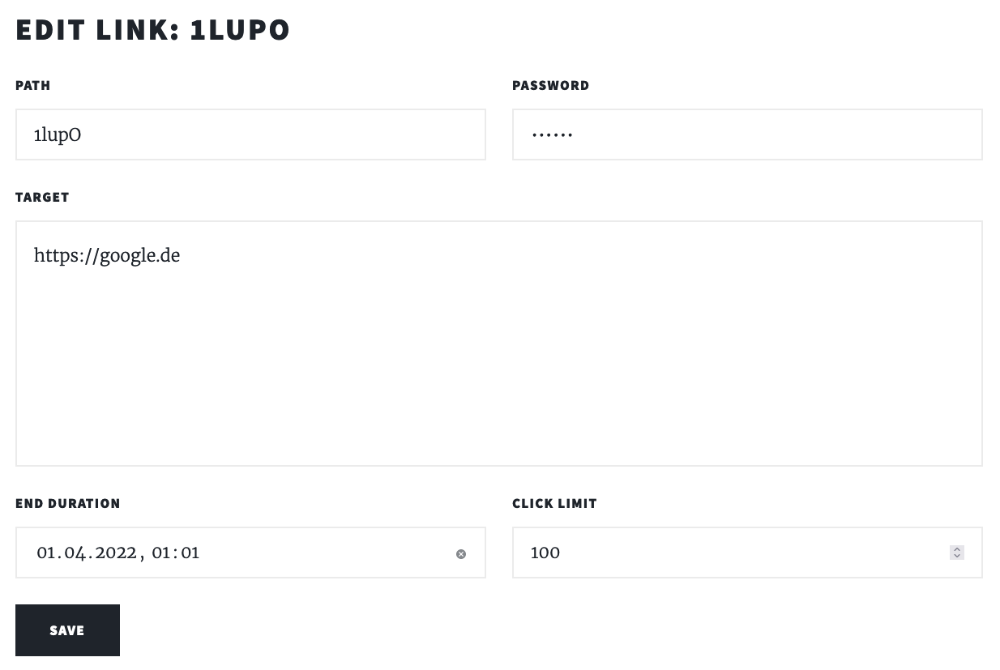

### Delete Shortened URL
Deleting a shortened link is intuitive and done via the overview explained in [Overview of Shortened URLs](#overview-of-shortened-urls).
By clicking on the `Delete` reference next to the desired to be deleted shortened URL and the confirming the appearing alert, the deletion is done.
After the successful deletion, the overview is being refreshed automatically.
The following image show the confirmation alert, which of course can be cancelled as well.

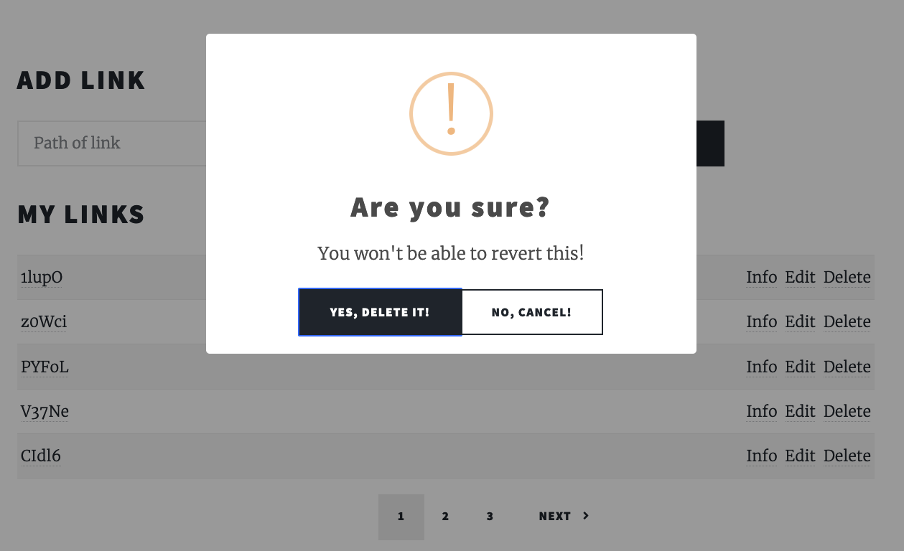

### Analyze Recent Shortened URLs
The overview of all targeted URLs from recently created shortened URLs is a new entry point of the service, accessible via `/recentLinks`.
This view shows all the public and valid targeted URLs of the recent 100 created shortened URLs, which means that password protected, click Limit reached or once which exceed the end duration won't show up in this view.
The disadvantage that there is no analyzing of those URLs with black lists for instance might lead to the deactivation of this whole entry point in the future.
And example is shown in the following image.

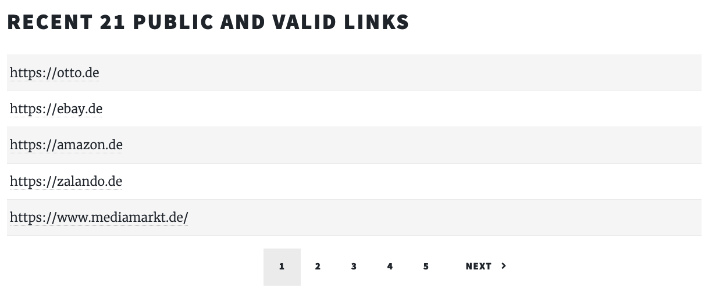

### Navigation
A navigation is always visible on the top and makes easy access to the entry points Home (`/`), My Links (`myLinks`) and Recent Links (`recentLinks`) possible, as shown in the following image.


### Sorry Page
The sorry page always appears when an error occurred, like when a desired path does not exist and can look like shown in the following image.
In consists of this sweet shocked owl, an explaining error message and the belonging HTTP Status code raised by the exception.


## Architecture
This chapter will tackle the architecture approach of the single service qshort application.

### Overview
The general overview of the architecture is shown in the following image.
qshort is deployed in a kubernetes cluster and uses ingress to expose the HTTPS routes outside the cluster to the QR-URL Service.
This service furthermore exposes the horizontally scalable in Pods running application.
Each Pod has with the DB Service access to a MongoDB running in a Pod as well.
Therefore, this MongoDB is also able to scale horizontally, which is currently not needed since reading the persistent volume claim of this database is the bottleneck anyway.

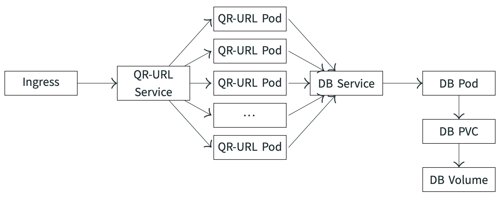

### Environments
qshort hast two separated environments:
- live, accessible via [1wp.de](https://1wp.de) or [qshort-6074.edu.k8s.th-luebeck.dev](https://qshort-6074.edu.k8s.th-luebeck.dev)
- develop, accessible via [dev.1wp.de](https://dev.1wp.de) or [develop.qshort-6074.edu.k8s.th-luebeck.dev](https://develop.qshort-6074.edu.k8s.th-luebeck.dev)

### Development
The whole development of the qshort service followed the branching concept that each commit onto the main branch is automatically been deployed onto the live environments and commits on all other branches automatically overwrites the current develop environment.
According to this concept, for each [Issue in Gitlab](https://git.mylab.th-luebeck.de/cloud-native/ws2021-22/personal-tom-huettmann/-/issues) a new branch was created and in the end integrated into main via a [Merge Request](https://git.mylab.th-luebeck.de/cloud-native/ws2021-22/personal-tom-huettmann/-/merge_requests).
Complementary to this is that the main branch is protected, so each issue has to be solved with the merge request procedure and therefore has been tested on the development environment before the final merge in live.

### Deployment
As already mentioned in [Development](#development), the deployment distinguishes between commits on the main branch and commits on not main branches.
This procedure has proven itself and will also scale with more than one developer.
Even setting different parameters for each environment is possible in Gitlab in the [CI/CD Settings](https://git.mylab.th-luebeck.de/cloud-native/ws2021-22/personal-tom-huettmann/-/settings/ci_cd) and was used to select a different amount of replica sets depending on the environment.

The `.gitlab-ci.yml` itself consist of four stages:
- check: checking the kubernetes cluster access and configures gitlab-registry-credentials for image pulls
- component: deploys mongo database with a persistent volume claim
- build: builds python-flask container image
- deploy: deploys project ingress to expose services cluster externally and deploys the python flask service to the desired environment

The distinction between a deployment to live or to develop has been realized with the
```
only:
  - main
```
respectively
```
except:
  - main
```
setting in the MongoDB and python deployment job.

The deployment yaml files itself uses the parameters `CI_ENVIRONMENT_NAME` and `CI_COMMIT_BRANCH` to either specifying the names of the services for instance or the unique name of the [container registries](https://git.mylab.th-luebeck.de/cloud-native/ws2021-22/personal-tom-huettmann/container_registry).
The CI/CD Variable `PYTHON_REPLICAS_AMOUNT` is used to specify the needed amount of replicas and can differ for each environment.

### Component Interactions
The only interaction between those already mentioned components, which hasn't been explained yet, is the interaction between the python service and the MongoDB.
To make the MongoDB accessible from python, python uses the name of the MongoDB deployment as the host.
Setting a special environment variable for each python deployment makes sure that for instance the live python service uses the live mongo service as well and looks like the following:
```
env:
- name: MONGO
  value: mongo-{{ CI_ENVIRONMENT_NAME }}
```


## Component Decisions Frontend
This chapter explains the made decisions according to the choices of frontend components.

### HTML Template
The decision to use an HTML template for the first basic initial setup was made immediately.
This basis for a responsive web application done by experts enables a foundation to build new layers on top.
The decision has fallen on [Massively](https://html5up.net/massively) from [HTML5Up](https://html5up.net/), because it's fully responsive, has a modern look, new pages can be integrated easily and has a license for personal and commercial use.
Even after the whole implementation, the decision was not regretted.
But of course is an HTML template always just a template and qshort needed hundreds of lines of code with individual adaption in the `css` classes and `Javascript` files.

### JavaScript
JavaScript with the [jQuery](https://jquery.com/) library came already from the HTMl template and therefore was used for further adaption as well.
The main intended use of this JavaScript code was to react on user inputs, making visual changes in the views and for the biggest part making asynchronous requests to the backend Apis and handle the received data.
The generous usage of JavaScript made the *single page service* for the core features possible.

### Simple Notify
There are a lot of JavaScript libraries available to show toast notifications, but [Simple-Notify](https://github.com/simple-notify/simple-notify) fits the best into the already set frontend layout and additionally is highly customizable and easy to integrate.
The own written function below was used to display such notification matching the response data from the apis and enables the automatic detection if a notification is such a success message displayed in green or should be an error message in red.
```
function showToast(message, status) {
    new Notify({
        type: 3,
        title: ((status >= 200 && status <= 299) ? 'Success' : 'Error') + ' (' + status + ')',
        text: message,
        status: (status >= 200 && status <= 299) ? 'success' : 'error',
        autoclose: true,
        autotimeout: 5000
    });
}
```
The following image is an example of the library in action and shows the notifications after successfully creating a shortened URL, and it's belonging QR-Code.

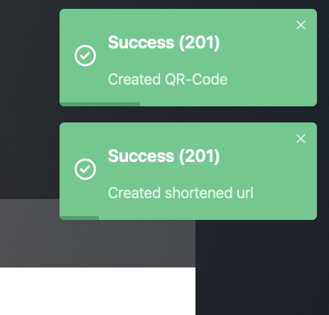

### Sweetalert2
To display modern confirmation alerts that also matches the already implemented frontend design, [Sweetalert2](https://github.com/sweetalert2/sweetalert2) fitted best.
It was also easy to integrate into the existing frontend code by just including the minified javascript file `sweetalert2.all.min.js`, which contains the frontend CSS styles as well.
As a further modification to the already nicely designed alerts, the given CSS styles according to the button designs were overwritten by the CSS styles given by the HTML template to match the already existing elements and buttons in other frontend entry points, as shown in the following image.
The only two use cases for these alerts are currently for confirming the deletion of a shortened URL and confirming the removal of the old password when modifying and shortened URL.

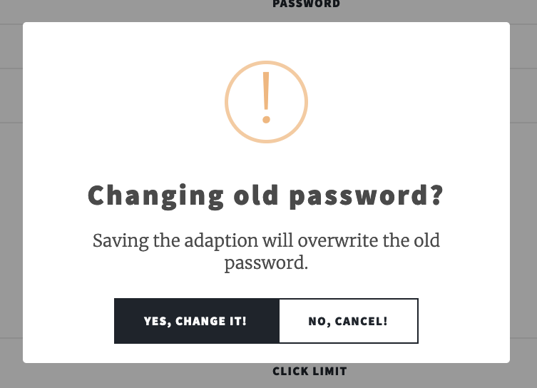


## Component Decisions Backend
This chapter explains the made decisions according to the choices of backend components.

### MongoDB
[MongoDB](https://www.mongodb.com/) is a document based NoSQL database management system and fits the needs of qshort perfectly.
With MongoDB, it's very easy to add extensive documents, and modify them later.
A standard SQL database would have been an overhead, and a Key-Value storage like [Redis](https://redis.io/) required more steps to handle the desired JSON format.
Last but not least, the biggest advantage in the use case of qshort of MongoDB was that data sets can be read very quickly, even with, even with the sometimes complicated queries.

### python:3-slim
The [python:3-slim](https://hub.docker.com/_/python) docker image was used for the qshort python container.
The reason why a switch from the `alpine` to the `slim` image was the requirement of some used python dependencies ([bcrypt](#bcrypt) and [qrcode](#qrcode)), which needed at least gcc.
The first try to install gcc to the `alpine` image resulted in a build step over multiple minutes and nearly the same image size as the image size of the `slim` variant.
Therefore, and for keeping the complexity low because no further steps and image layers were needed, the decision to use the `slim` variant was pretty clear.

### flask
Besides that [Flask](https://flask.palletsprojects.com/en/2.0.x/) was a requirement for the implementation of qshort, it has proven itself.
It is simple to achieve first draft endpoints and the finalization was with the used [Jinja](https://www.palletsprojects.com/p/jinja/) possible.
The advantage here is the large user group and numerous existing extensions.

### structlog
[structlog](https://www.structlog.org/en/stable/), as it already says, helped to introduce structured logging.
The already given code snippets of its usage worked perfectly and in overall it fulfilled all requirements of qshort, so there was no need to search for alternatives.

### pymongo
[PyMongo](https://pymongo.readthedocs.io/en/stable/) is by far the most used and biggest python library to realize the connection to a MongoDB.
The choice for another alternative dependency was thus out of the question at that point.
In practice, it performed well, fast and even implementing queries with higher complexity were no major problem.

### flask_restful
[FlaskRESTful](https://flask-restful.readthedocs.io/en/latest/) is already an extension for flask and therefore extremely compatible with a huge user group and a lot of documentation and examples.
Implementing API endpoints in separated class files and connecting them with the initialized flask application was possible and straight forward.
The similar alternative [Flask RestPlus](https://github.com/noirbizarre/flask-restplus) with maybe slightly better options for the following documentation could be a better solution at all, but it not that maintained either.
Therefore, [Flask RESTX](https://github.com/python-restx/flask-restx), a fork of Flask RestPlus, could be worth a try for the next big refactoring.
But to keep it clear, FlaskRESTful was still a good decision and fitted all needs of qshort.

### nanoid
[Nano ID](https://github.com/puyuan/py-nanoid) was used to generate those unique shortened URL paths and also for generating its master key.
It is a pretty fast library with the benefit of generating secure IDs, that's why writing such functionality by hand was never an option over this library.
One benefit of this library over others is that it's possible to choose the desired length of the generated ID, this made implementing the feature with the desired path length of the shortened URL a lot easier.

### bcrypt
Storing passwords or key in plain text is always a bad idea, otherwise a database leak could also leak those confidential values as well.
Therefore, using a hashing library was needed, and the choice is made for [bcrypt](https://pypi.org/project/bcrypt/).
It's a pretty active and modern open source library which a huge user base and facilitates the creation of even salted hashes.
A good benefit over other alternatives is that bcrypt doesn't need to store those used salts in a database or something else as well, it manages this completely automatically.

### qrcode
There exist a lot of libraries that support creating QR-Codes from given inputs.
[qrcode](https://pypi.org/project/qrcode/) is a library with many active contributors and creates from a given input string [Pillow](https://pypi.org/project/Pillow/) images, which means that even further adaption and modifications of the generated images are possible.
Furthermore, qrcode has the option for an advanced usage and set many parameters.
This enables a lot more features implemented in qshort to modify the generated QR-Codes in the future.

### apispec
One small disadvantage with the chosen rest api library, already explained in [flask_restful](#flask_restful), was its documentation.
The only library with that made an initial setup without extra heavy steps possible was actually [apispec](https://apispec.readthedocs.io/en/latest/).
Still the usage was not that intuitive, documentations seems to be outdated or at least doesn't match perfectly with FlaskRESTful and all in all made some problems.
For instance, setting the `openapi_version` to the "*newest*" `3.0.2` version resulted in flaky generation of the example responses of API endpoints.
But setting it to the `2.0` version resulted into missing example values for the API request parameters.
So the final decision was to take the lesser evil, use version `2.0` and write the example values into the field description of the API request parameters.
All in all was the handling and the use of the library not so easy but the final result with the generated swagger json file rendered inside a swagger endpoint was nevertheless satisfactory enough for an extensive and easy to understand API documentation with an intuitive appearance.


## Twelve-Factor App
This chapter goes through the [Twelve Factors](https://12factor.net/de/) of App develop and checks if the qshort service fulfills them.
A check mark at the beginning of the chapter indicates that qshort fulfills this requirement, followed by a brief explanation.

### 1. Codebase
- [x] The whole codebase, including deployment scripts, are managed in Gitlab and therefore uses version control.

### 2. Dependencies
- [x] All dependencies are strictly isolated.
  The only exception could be the HTML template, which from the current perspective is more like a fork from the original dependency and therefore fully integrated in the qshort codebase.
  All python dependencies are declared in the separated `requirements.txt` file.

### 3. Configuration
- [x] Currently, qshort doesn't need separated configuration files for the two different environments, all configuration files use CI/CD variables or ci variables from Gitlab itself.
  For example: `CI_ENVIRONMENT_NAME`, `CI_COMMIT_BRANCH` or `PYTHON_REPLICAS_AMOUNT`.

### 4. Supported Services
- [x] The supporting MongoDB service is handled as an attached resource and not integrated into the backend deployment for instance.
  It is deployed separately.

### 5. Build, Release, Run
- [x] The deployment is strictly separated in build, release and run phases.
  Besides to that, there doesn't exist typical releases, each commit to the main branch can be seen as an individual release.
  Therefore, a rollback to each release is possible by a cherry-pick for instance.

### 6. Process
- [x] The qshort service is running as a single process inside a docker container.
  It's possible to scale those horizontally so each container can run separately accessed by the round-robin load balancing strategy.

### 7. Port Binding
- [x] The qshort service running on the port `8080` is exposed via an ingress route.

### 8. Concurrency
- [x] The qshort running backend and MongoDB container can run concurrent.
  The only bottleneck is the persistent volume of the MongoDB.

### 9. Disposable Use
- [x] Container can be thrown away, started and stopped quickly.
  This is important for the fast deployment and elastic scaling.

### 10. Dev-Prod-Comparability
- [x] Both environments `develop` and `live` act identical and therefore can be compared pretty well.
  Changes and bugs affecting the `develop` environment for instance would affect `live` as well and vice versa.

### 11. Logs
- [x] Each log entry is written on `stdout` and treated as a stream of events.

### 12. Admin Processes
- [x] Currently, there doesn't exist admin processes in the qshort service.
  Nevertheless, the current architecture would make implementing some in the future, like a cleanup job who deletes unused shortened URLs from the mongo database, possible.


## Api Documentation
The Swagger-UI of the Api documentation is, as already mentioned in [apispec](#apispec), accessible via the entrypoint `/api/` and looks like the image below.
- develop: [1wp.de/api/](https://1wp.de/api/) or directly [qshort-6074.edu.k8s.th-luebeck.dev/api/](https://qshort-6074.edu.k8s.th-luebeck.dev/api/)
- live: [dev.1wp.de/api/](https://dev.1wp.de/api/) or directly [develop.qshort-6074.edu.k8s.th-luebeck.dev/api/](https://develop.qshort-6074.edu.k8s.th-luebeck.dev/api/)

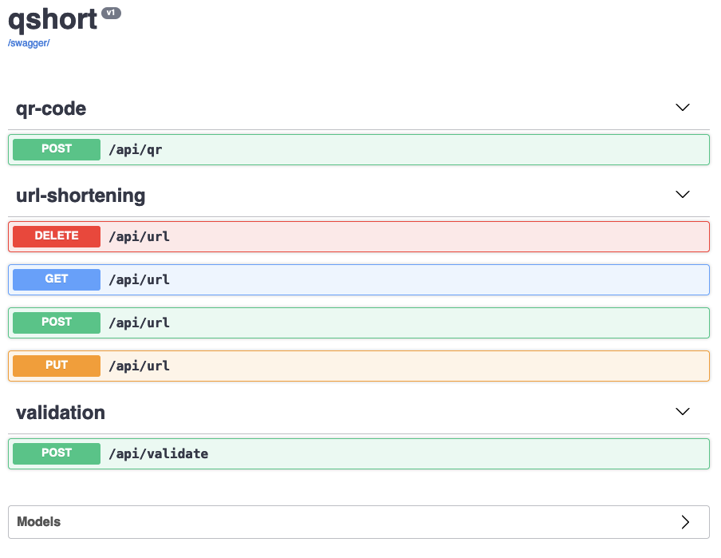
